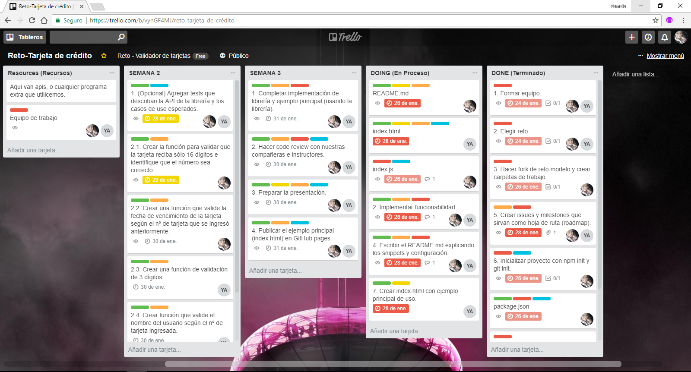
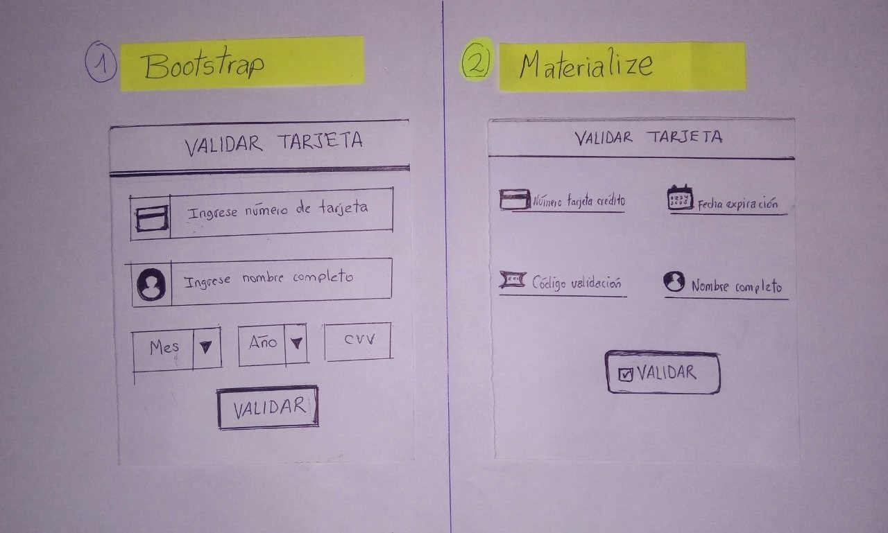
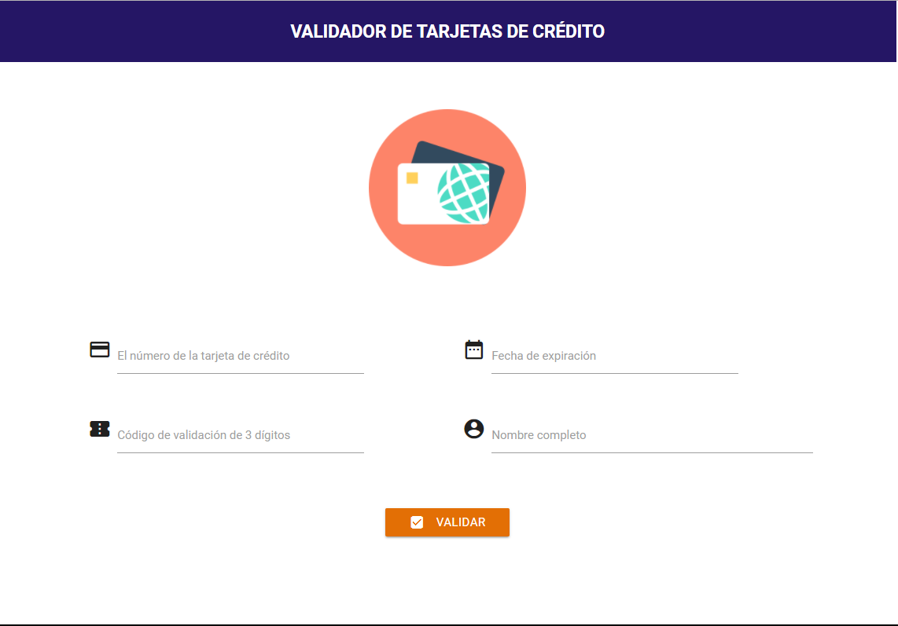
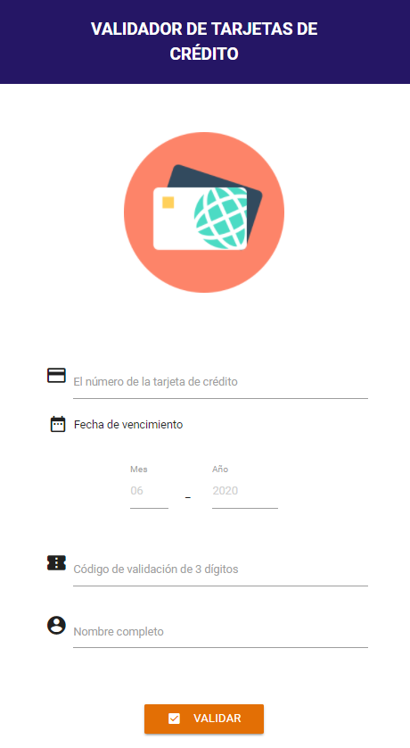

# Valida datos de tarjetas de crédito

* **Track:** _Common Core_
* **Curso:** _JS Deep Dive: Crea tu propia librería usando JavaScript_
* **Unidad:** _Producto final_
* **Reto:** _N° 1_

***
## Objetivo

Implementar un validador de datos de tarjeta de crédito. La librería debería validar el número de tarjeta de crédito (usando algoritmo de Luhn), fecha de vencimiento, codigo de verificación (cvv) y nombre completo que aparece en la tarjeta.

## Restricciones

El plugin debe recibir una referencia a un elemento del DOM que contenga
`<input>`s con los siguientes nombres (atributo `name`):

* `cn` (Card Number): El número de la tarjeta de crédito
* `exp` (Expiry Date): Fecha de expiración
* `cvv` (Card Verification Value): Código de validación de 3 dígitos
* `name`: Nombre completo como aparece en la tarjeta

## Ejemplo

```html
<form>
  <div class="form-group">
    <label for="cn">Número de tarjeta</label>
    <input id="cn" name="cn" />
  </div>
  <div class="form-group">
    <label for="exp">Fecha de vencimiento</label>
    <input id="exp" name="exp" />
  </div>
  <div class="form-group">
    <label for="cvv">CVV</label>
    <input id="cvv" name="cvv" />
  </div>
  <div class="form-group">
    <label for="name">Nombre completo</label>
    <input id="name" name="name" />
  </div>
  <input type="submit" value="Pagar" />
</form>
```

```js
const form = document.querySelector('form');

form.addEventListener('submit', (e) => {
  e.preventDefault();
  if (validateCardDetails(form)) {
    console.log('datos válido... enviar...');
  } else {
    console.log('datos inválidos');
  }
});
```

A la hora de hacer las validaciones, la librería debería de añadir la clase
`.error` a los `<input>`s que no pasen la validación, o la clase `.success`
en caso de que sí pase.

## Planificación

La asignación de tareas se distribuyo por partes iguales, utilizando el software de administración *TRELLO*, desde el inicio que se formo el grupo seleccionando asi el **Reto 1 - (Card Validator).** 
Puedes ver el tablero de planificación en el siguiente link: [https://trello.com/b/vynGF4MJ/reto-tarjeta-de-cr%C3%A9dito]()



### Semana 1 
*_Miércoles 24 de Enero_*
* Formar equipo.
* Elegir reto.
* Hacer fork de reto modelo propuesto por Laboratoria.

*_Viernes 26 de Enero_*
* Crear index.html con ejemplo principal de uso.
  
*_Domingo 28 de Enero_*
* Escribir primera versión del README.md con una descripción general de la librería así como ejemplos (snippets) de uso y configuración (si fuera necesario).
* Crear issues y milestones que sirvan como hoja de ruta (roadmap).

### Semana 2
*_Domingo 28 de Enero_*
* Agregar tests que describan la API de tu librería y los casos de uso esperados.

*_Sábado 27 - Domingo 28 de Enero_*
* Implementar funcionalidad esencial.
* Hacer code review con tus compañeras e instructorxs.

### Semana 3
*_Lunes 29 - Miércoles 31 de Enero_*
* Completar implementación de librería y ejemplo principal (usando la librería).
* Hacer code review con tus compañeras e instructorxs.
* Preparar tu demo/presentación.
* Publicar el ejemplo principal (index.html) en GitHub pages.

## Progreso

### Libreria (Validación de tarjeta de crédito)
Proporciona utilidades de validación para las entradas de datos de la tarjeta de crédito.


### Snippets

Ejemplo de snippet, que será modificado para mejorar la librería de validación de tarjeta.

* Función para validar CVV de 3 dígitos
    : La siguiente función se encarga de validar mediante condiciones de longitud
      y tipo de datos que él usuario sólo ingrese 3 números. Si el usuario ingresa
      3 números la variable `validThree` tendrá como valor `true`, si ingresa menos
      números o algo diferente a lo que se le solicita la variable `validThree`
      será igual a `false` y si sobrepasa la longitud de `3` dígitos se disparará
      un `alert` con el mensaje `No debe exceder los 3 dígitos`.

      _Snippets:_
      inputCvvElement.val() //  '586'
      inputCvvElement.keyup(cvvValidation); //   validThree = true
      inputCvvElement.val() //   '58'
      inputCvvElement.keyup(cvvValidation); //   validThree = false

* Función para validar nombre completo
    : La siguiente función se encarga de validar mediante condiciones dónde
      se testean los datos y se verifica la longitud del mismo. Si el usuario
      ingresa alguna palabra no menos a `3` letras, la variable `validFour`
      tendrá como valor `true`, si ingresa menos letras o algo diferente
      a lo que se le solicitó la variable `validFour` será igual a `false`.

      _Snippets:_
      inputNameElement.val() //  'Ana Torres Paredes'
      inputNameElement.keyup(nameValidation); //  validFour = true
      inputNameElement.val() //  'An'
      inputNameElement.keyup(nameValidation); //  validFour = false
      inputNameElement.val() //  '4255'
      inputNameElement.keyup(nameValidation); //  validFour = false

## Herramientas utilizadas

* HTML5
* CSS3
* jQuery
* Node.js
* ECMAScript 6
* Materialize

## Producto Final

#### Sketch

* Se realizó dos tipos de prototipos de diferentes frameworks para poder seleccionar cual se maquetaria.




#### Versión desktop
* Vista desde la ventana del navegador desktop.



#### Versión móvil
* Vista desde la ventana del navegador móvil.



## Contribuidoras

* Pamela De la cruz Lozano
* Yanira Jazmín Arenazas Bueno


