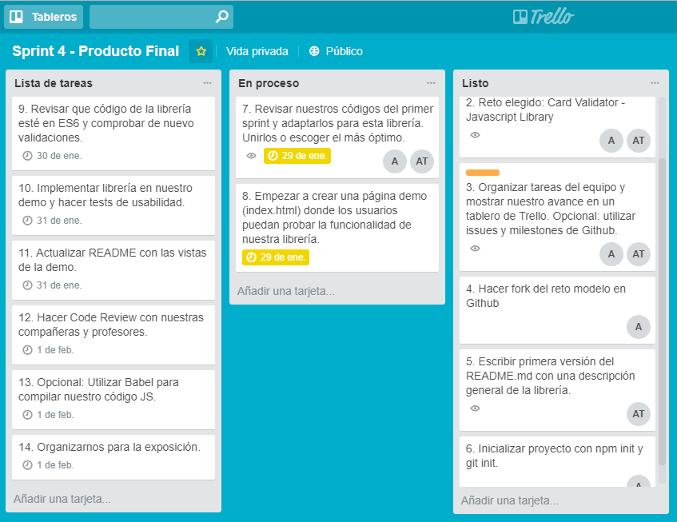

# Card Validator
### Plugin útil para validar datos ingresados en formularios de tarjetas de débito y tarjetas de crédito.
***

## Colaboradoras:
* Ana Díaz
* Andrea Tellería

## Plan de Organización
[Tablero público](https://trello.com/b/w8PlFEgb/sprint-4-producto-final) en Trello donde se puede hacer seguimiento de nuestro avance diario y deadlines establecidos.



## Características
El plugin debe recibir una referencia a un elemento del DOM que contenga
`<input>`s con los siguientes nombres (atributo `name`):

* `cn` (Card Number): El número de la tarjeta de crédito
* `exp` (Expiry Date): Fecha de expiración
* `cvv` (Card Verification Value): Código de validación de 3 dígitos
* `name`: Nombre completo como aparece en la tarjeta

A la hora de hacer las validaciones, la librería debería de añadir la clase
`.error` a los `<input>`s que no pasen la validación, o la clase `.success`
en caso de que sí pase.

## Ejemplo
```html
<form>
  <div class="form-group">
    <label for="cn">Número de tarjeta</label>
    <input id="cn" name="cn" />
  </div>
  <div class="form-group">
    <label for="exp">Fecha de vencimiento</label>
    <input id="exp" name="exp" />
  </div>
  <div class="form-group">
    <label for="cvv">CVV</label>
    <input id="cvv" name="cvv" />
  </div>
  <div class="form-group">
    <label for="name">Nombre completo</label>
    <input id="name" name="name" />
  </div>
  <input type="submit" value="Pagar" />
</form>
```

```js
const form = document.querySelector('form');

form.addEventListener('submit', (e) => {
  e.preventDefault();
  if (validateCardDetails(form)) {
    console.log('datos válido... enviar...');
  } else {
    console.log('datos inválidos');
  }
});
```

## Glosario

### Líbrería de Javascript
Una biblioteca (library) es un conjunto de implementaciones funcionales, codificadas en un lenguaje de programación, que ofrece una interfaz bien definida para la funcionalidad que se invoca.

### Algoritmo de Luhn
El algoritmo de Luhn, en base al cual creamos esta librería, es un método creado para la verificación de números de identificación, como los números de las tarjetas de crédito (Visa, MasterCard) o el IMEI de los teléfonos móviles.

Este algoritmo es muy simple, nos dice que dada un número que contenga solamente dígitos [0-9], una tarjeta de crédito es válida si y solo si, obteniendo la reversa de este número, y la suma sus dígitos debe ser un múltiplo de 10, es decir que la suma módulo 10 debe ser igual a cero.

## Herramientas Utilizadas
* Trello
* HTML5
* CSS3
* Javascript (ES6)

